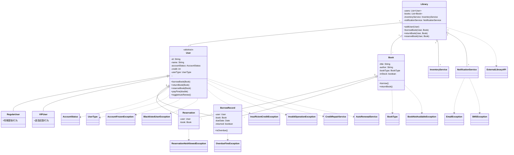

# 类结构与关系说明

## 文本说明

- User （抽象类）：  \n  - 子类：RegularUser、VIPUser\n  - 聚合/组合 BorrowRecord、Reservation\n  - 依赖 Book, AccountStatus, UserType\n- Book：  \n  - 被 BorrowRecord、Reservation 关联\n- Library：  \n  - 管理 User、Book、InventoryService、NotificationService\n  - 连接 ExternalLibraryAPI\n- Service 类：  \n  - NotificationService, InventoryService, CreditRepairService, AutoRenewalService\n- 异常类：  \n  - 业务异常、提醒警告、通知异常等\n- 枚举类：  \n  - BookType, UserType, AccountStatus

## 类关系Mermaid图

